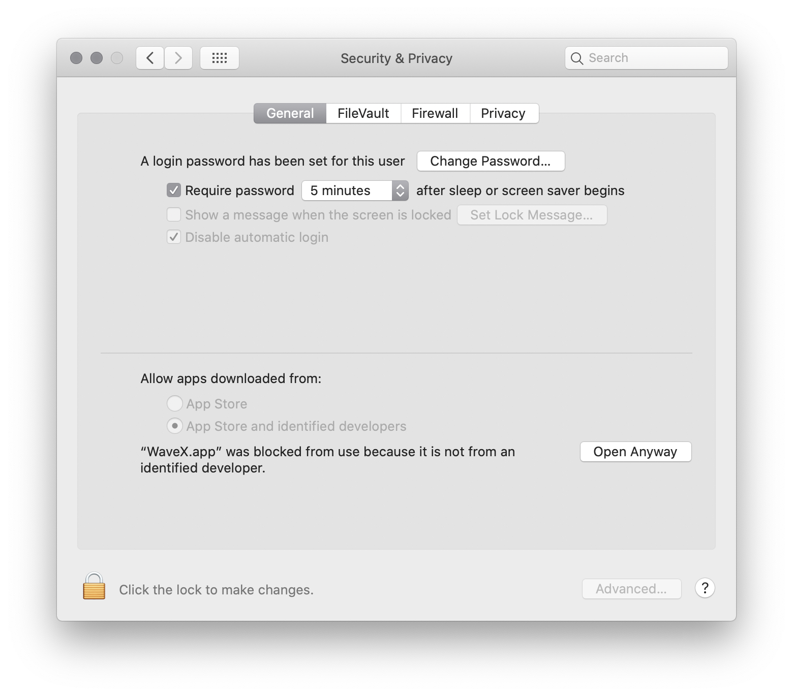
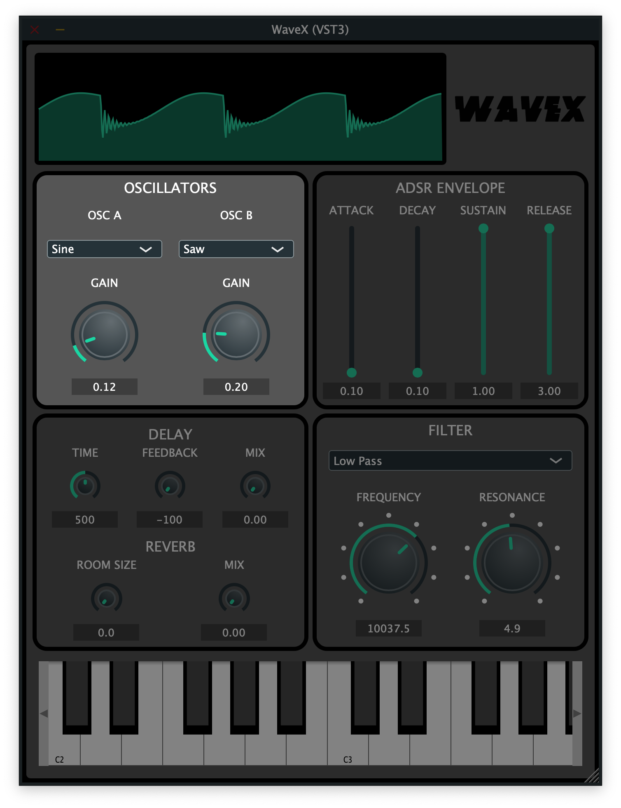
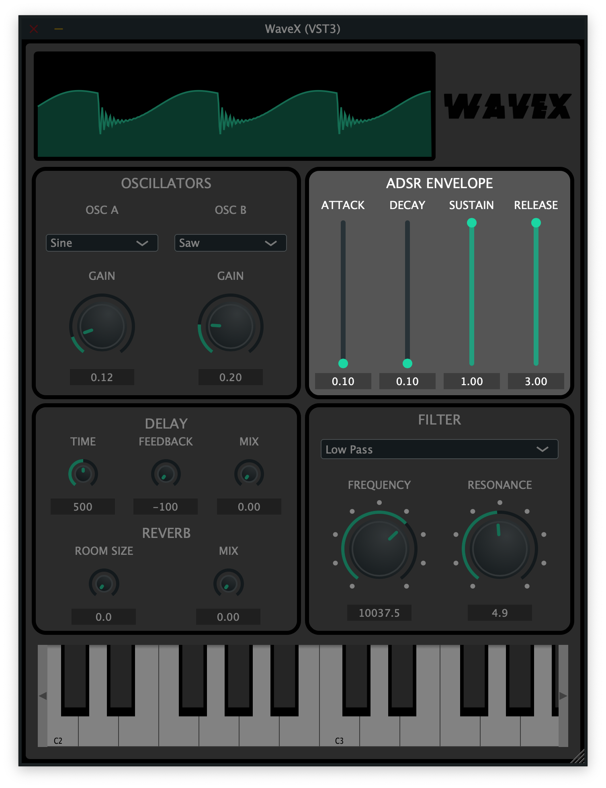
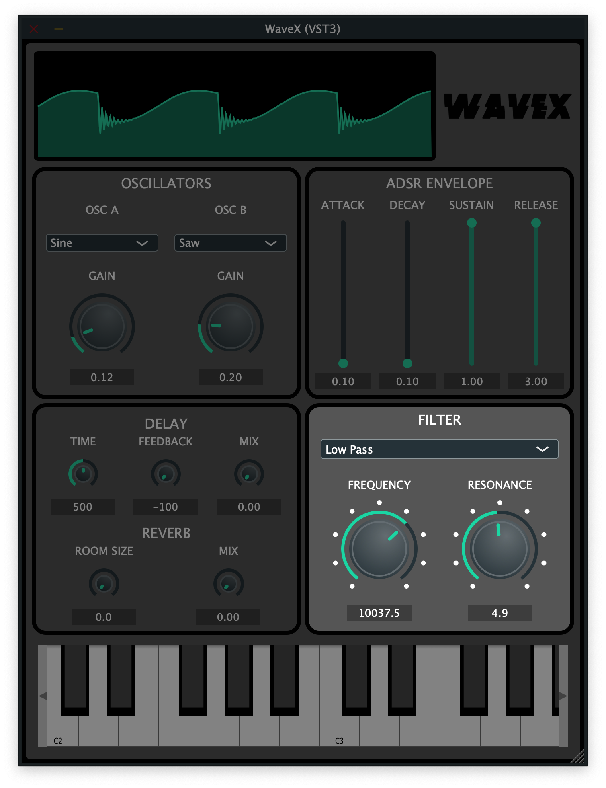
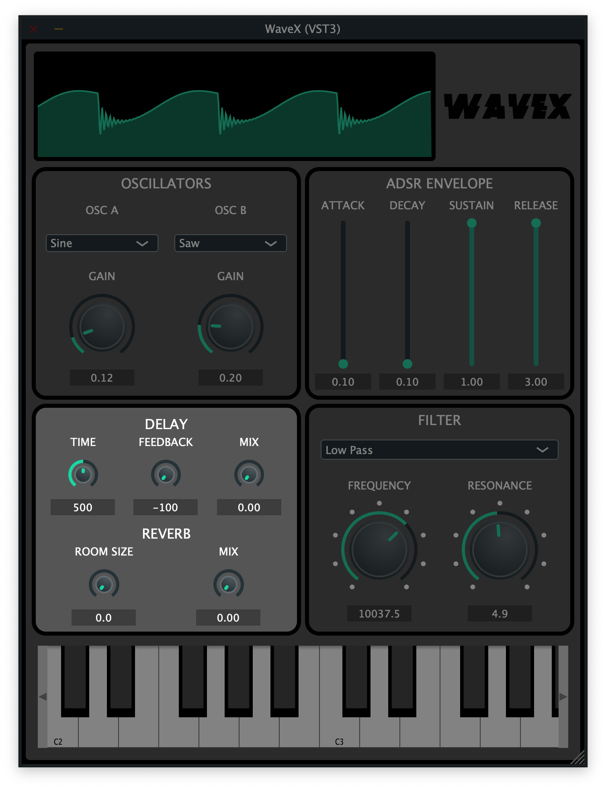
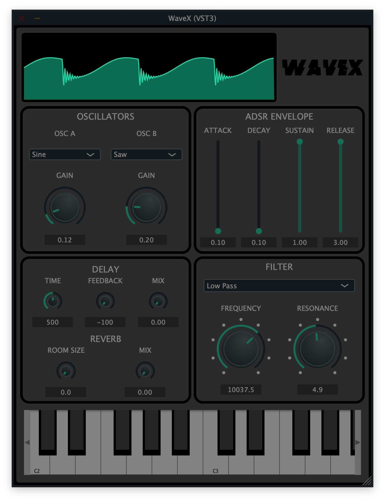
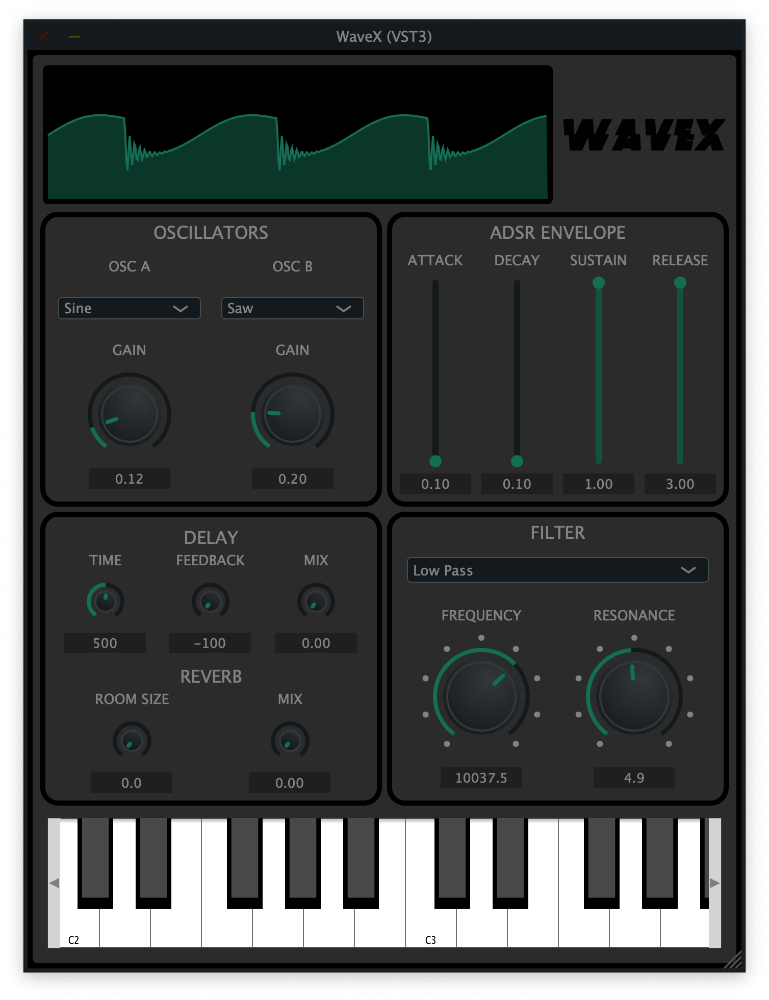

# 7.0 WaveX - User Manual / Installation Guide
## TABLE OF CONTENTS
**7.1    Installation Instructions** \
**7.1.1 Standalone Installation** \
**7.1.2 VST3 Installation** \
**7.1.3 AU Installation** \
**7.2    Uninstall Instructions** \
**7.3    Feature Overview** \
**7.3.1 Oscillators** \
**7.3.2 ADSR Envelope** \
**7.3.3 Filter** \
**7.3.4 Delay and Reverb** \
**7.3.5 Waveform Visualizer** \
**7.3.6 Keyboard** \
**7.4    Contact** 

## 7.1 Installation Instructions
WaveX is supported on MacOS 10.15 and later. It can be installed as either a standalone app, a VST3 plugin, or an AU plugin. The VST3 and AU formats can only be run from within a supported DAW (digital audio workstation) such as Ableton Live or FL Studio.

### 7.1.1 Standalone
- Download the [standalone version](https://github.com/georgeh02/seniorproject2/blob/main/WaveX%20Builds/WaveX.app.zip) of WaveX
- Unzip, and open WaveX.app
- You may be prompted with a security warning

- Navigate to security and privacy settings and click 'open anyway'

### 7.1.2 VST3
- Download the [VST3 version](https://github.com/georgeh02/seniorproject2/blob/main/WaveX%20Builds/WaveX.vst3.zip) of waveX
- Unzip, and move WaveX.vst3 to "/Library/Audio/Plug-Ins/VST3"
- Open your DAW of choice and rescan for new plugins
- WaveX will be available as a VST3 plugin to use within your DAW

### 7.1.3 AU
- Download the [AU version](https://github.com/georgeh02/seniorproject2/blob/main/WaveX%20Builds/WaveX.component.zip) of WaveX
- Unzip, and move WaveX.component to "/Library/Audio/Plug-Ins/Components"
- Open your DAW of choice and rescan for new plugins
- WaveX will be available as an AU plugin to use within your DAW

## 7.2 Uninstall Instructions
### Standalone
- Delete WaveX.app
### VST3
- Delete WaveX.vst3, located in "/Library/Audio/Plug-Ins/VST3"
### AU
- Delete WaveX.component, located in "/Library/Audio/Plug-Ins/Components"

## 7.3 Feature Overview
This section describes in detail the functionality of WaveX's features

## 7.3.1 Oscillators

- WaveX includes two oscillators.
- Each oscillator's waveform type can be selected from the dropdown menus.
- Sine, Saw, and Square waveform types are available
- Each oscillator has an independant gain control, to control it's volume

## 7.3.2 ADSR Envelope

- The ADSR envelope is applied to the mixed output of the oscillators
- The attack, decay, sustain, and release sliders can be used to adjust the envelope

## 7.3.3 Filter

- The filter has three types that can be selected from the drop down
- Low Pass, High Pass, and Band Pass
- The frequency cutoff can be set using the frequency dial
- The resonance can be set using the resonance dial

## 7.3.4 Delay and Reverb

### Delay
- The delay effect has a time dial to set the delay in MS
- The feedback dial controls the volume of trailing delays in DB
- The mix dial allows you to control how much of the delayed signal is mixed into the original signal

### Reverb
- The reverb is applied after the delay
- The room size dial makes the reverb bigger and spacier
- The mix dial allows you to control how much of the reverberated signal is mixed into the original signal

## 7.3.5 Waveform Visualizer

- The waveform visualizer allows you to see a visual representation of your sound as you design and play it
- It is live and responds to any notes played

## 7.3.6 GUI Keyboard

- The GUI keyboard allows you to preview your sounds without needing a MIDI keyboard
- The small arrows on the left and right can be used to transpose the keyboard up and down octaves

## 7.4 Contact
For troubleshooting issues or support, please contact support@wavex.com
