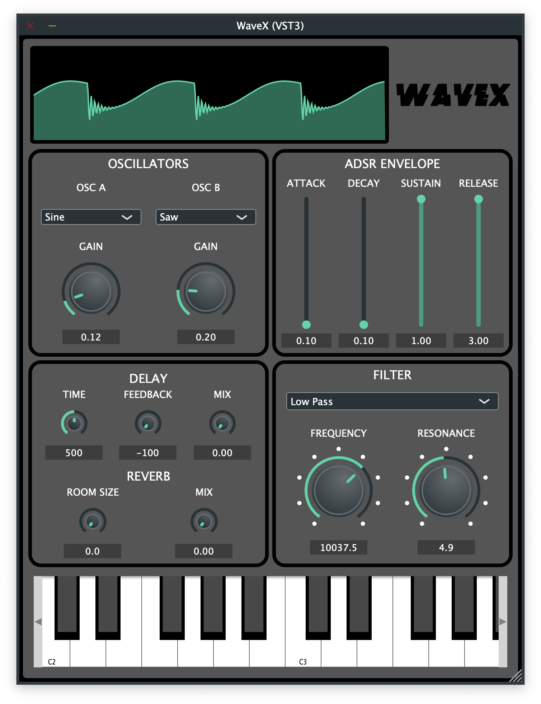

# [WaveX](https://georgeh02.github.io/WaveX/)
by George Harrison

LOGO

WaveX is a simple monophonic synthesizer created using the JUCE framework.
It features a variety of components that make sound design easy.

## WaveX Features
- 2 oscillators with 3 different wave types and gain controls
- ADSR module to control attack, decay, sustain, release
- Filter module
- Delay module
- Reverb module
- Waveform Visualizer
- A clean and organized GUI with a playable keyboard
- Compatible with MacOS (Standalone, VST3, AU formats)
- FL Studio and Ableton Live

## Installation Instructions
### Standalone
- WaveX can be easily run in standalone mode by running WaveX.app
- Preview the sounds you create by using the GUI keyboard

### Within a DAW
- WaveX can be used within most DAWs as a third party plugin, allowing you to compose songs with it
- To use WaveX within your DAW, download your preferred plugin format
    - For VST3, copy WaveX.vst3 file to "/Library/Audio/Plug-Ins/VST3"
    - For AU, copy WaveX.component file to "/Library/Audio/Plug-Ins/Components"
- Once your preferred version is installed, simply rescan your DAW and WaveX will be ready to use

SCREENSHOT
